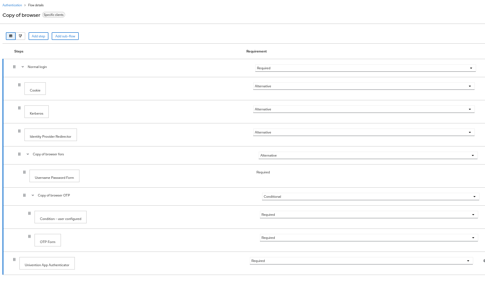
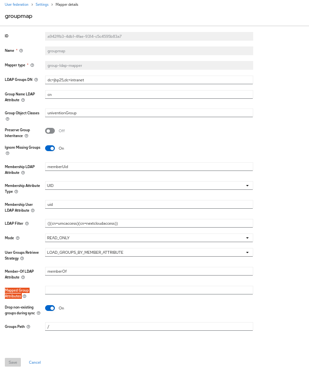

# Configure this App authenticator

## Prerequisites:
1. Keycloak has been installed with this docker image:
   gitregistry.knut.univention.de/univention/dev/projects/keycloak/keycloak-app:branch-jbremer-appauthorization
2. The UMC has been adjusted to use Keycloak
3. An App (Nextcloud?) has been adjusted to use Keycloak

## Configuration:
### 1. Create a new authentication flow

   Go to the Keycloak admin console. Go to `Authentication`

   Click on the option on the flow `browser`. Duplicate it.

   Now the ugly part:
   You have to basically copy everything on this flow.
   Everything that is part of the default flow needs to be in its own subflow. I called it "Normal login".
   The new Univention App Authenticator needs to be required, and on the same level as the rest of the flow.

   

### 2. Attach this flow to the clients.
   In the Keycloak admin console go to `Clients`.

   Click on the UMC client. Go to `Advanced`. On the bottom there is the field
   `Authentication flow overrides`. Set it to the new flow.

### 3. Create the group mapper
   Go to `User federation`. Select the `ldap-federation`. Go to `Mappers`.
   Click on `new mapper` and select the mapper type `group-ldap-mapper`.
   Configure it in the following way:

   

   There is a `Action` field on the top right. Select `Sync LDAP groups to Keycloak`
   to sync them all immediately.

### 4. Create the client roles
   In the Keycloak admin console go to `Clients`.
   Click on your client and go to `Roles`.
   Click on `Create role` and enter the name `univentionClientAccess`.

### 5. Attach the client role to the group.
   Go to `Groups`. Click on the desired group and select `Role mapping`.
   Click `Assign role`. `Filter by client roles`.
   Then select the client role.

